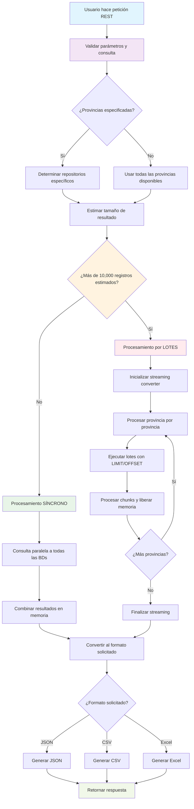

# Sistema de Consulta Dinámica de Infracciones de Tránsito

## Descripción del Proyecto

Este sistema es una **aplicación de reportes y consultas** diseñada para realizar consultas dinámicas sobre bases de datos de infracciones de tránsito de múltiples provincias argentinas. El sistema permite generar reportes especializados con capacidad de manejar **grandes volúmenes de datos** (hasta 800,000+ registros) mediante procesamiento por lotes y optimización de memoria.

### Características Principales

- **Multi-provincia**: Consulta simultánea a múltiples bases de datos independientes (Buenos Aires, Avellaneda, La Pampa, Chaco, Entre Ríos, Formosa)
- **Consultas dinámicas**: Sistema de filtros avanzados con parámetros configurables
- **Procesamiento escalable**: Automáticamente decide entre procesamiento síncrono o por lotes según el volumen de datos
- **Múltiples formatos**: Exportación en JSON, CSV y Excel
- **Optimización de memoria**: Gestión inteligente de memoria para consultas masivas
- **Streaming de datos**: Procesamiento por chunks para evitar desbordamiento de memoria


## Estructura del Proyecto

```
src/
├── main/
│   ├── java/org/transito_seguro/
│   │   ├── App.java                           # Clase principal Spring Boot
│   │   │
│   │   ├── component/                         # Componentes de procesamiento
│   │   │   ├── BatchProcessor.java            # Procesamiento por lotes con gestión de memoria
│   │   │   ├── ConsultaValidator.java         # Validación de parámetros y provincias
│   │   │   ├── FormatoConverter.java          # Conversión a JSON/CSV/Excel (síncrono)
│   │   │   ├── StreamingFormatoConverter.java # Conversión streaming para grandes volúmenes
│   │   │   └── ParametrosProcessor.java       # Procesamiento dinámico de parámetros SQL
│   │   │
│   │   ├── config/                           # Configuración del sistema
│   │   │   ├── DataSourceConfig.java         # Configuración de conexiones a BD
│   │   │   ├── JdbcConfig.java               # Templates JDBC por provincia
│   │   │   └── ProvinciaMapping.java         # Mapeo provincia → datasource
│   │   │
│   │   ├── controller/                       # Controladores REST
│   │   │   ├── InfraccionesController.java   # Endpoints de consulta (CON límite)
│   │   │   └── DescargarInfraccionesController.java # Endpoints de descarga (SIN límite)
│   │   │
│   │   ├── dto/                              # Objetos de transferencia
│   │   │   ├── ConsultaQueryDTO.java         # DTO principal de consulta
│   │   │   └── ParametrosFiltrosDTO.java     # DTO de filtros dinámicos
│   │   │
│   │   ├── enums/                            # Enumeraciones
│   │   │   └── Consultas.java                # Mapeo de tipos de consulta → archivos SQL
│   │   │
│   │   ├── exception/                        # Manejo de excepciones
│   │   │   └── ValidationException.java      # Excepciones de validación
│   │   │
│   │   ├── factory/                          # Factoría de repositorios
│   │   │   └── RepositoryFactory.java        # Crear repositorios por provincia
│   │   │
│   │   ├── repository/                       # Capa de acceso a datos
│   │   │   ├── InfraccionesRepository.java   # Interfaz del repositorio
│   │   │   └── impl/
│   │   │       └── InfraccionesRepositoryImpl.java # Implementación por provincia
│   │   │
│   │   ├── service/                          # Lógica de negocio
│   │   │   └── InfraccionesService.java      # Servicio principal de consultas
│   │   │
│   │   └── utils/                            # Utilidades
│   │       └── SqlUtils.java                 # Carga y cache de queries SQL
│   │
│   └── resources/
│       ├── application.yml                   # Configuración principal
│       └── querys/                           # Archivos SQL de consultas
│           ├── consultar_personas_juridicas.sql
│           ├── reporte_infracciones_general.sql
│           ├── reporte_infracciones_detallado.sql
│           ├── reporte_infracciones_por_equipos.sql
│           ├── reporte_radar_fijo_por_equipo.sql
│           ├── reporte_semaforo_por_equipo.sql
│           ├── reporte_vehiculos_por_municipio.sql
│           ├── reporte_sin_email_por_municipio.sql
│           └── verificar_imagenes_subidas_radar_concesion.sql
```

## Diagrama de Flujo del Sistema



## Tipos de Consultas Disponibles

El sistema soporta los siguientes tipos de consultas especializadas:

| Tipo de Consulta | Endpoint | Descripción | Archivo SQL |
|------------------|----------|-------------|-------------|
| `personas-juridicas` | `/api/infracciones/personas-juridicas` | Consulta de personas jurídicas con CUIT | `consultar_personas_juridicas.sql` |
| `infracciones-general` | `/api/infracciones/infracciones-general` | Reporte general de infracciones | `reporte_infracciones_general.sql` |
| `infracciones-detallado` | `/api/infracciones/infracciones-detallado` | Reporte detallado con información completa | `reporte_infracciones_detallado.sql` |
| `infracciones-por-equipos` | `/api/infracciones/infracciones-por-equipos` | Infracciones agrupadas por equipo | `reporte_infracciones_por_equipos.sql` |
| `radar-fijo-por-equipo` | `/api/infracciones/radar-fijo-por-equipo` | Específico para radares fijos | `reporte_radar_fijo_por_equipo.sql` |
| `semaforo-por-equipo` | `/api/infracciones/semaforo-por-equipo` | Específico para semáforos (luz roja/senda) | `reporte_semaforo_por_equipo.sql` |
| `vehiculos-por-municipio` | `/api/infracciones/vehiculos-por-municipio` | Análisis de vehículos por municipio | `reporte_vehiculos_por_municipio.sql` |
| `sin-email-por-municipio` | `/api/infracciones/sin-email-por-municipio` | Infracciones sin datos de email | `reporte_sin_email_por_municipio.sql` |
| `verificar-imagenes-radar` | `/api/infracciones/verificar-imagenes-radar` | Verificación de imágenes por radar | `verificar_imagenes_subidas_radar_concesion.sql` |

## Arquitectura de Base de Datos

### Provincias Soportadas
- **Buenos Aires** (`pba`)
- **Avellaneda** (`mda`)
- **La Pampa** (`santa-rosa`)
- **Chaco** (`chaco`)
- **Entre Ríos** (`entre-rios`)
- **Formosa** (`formosa`)

### Esquema de Datos
Todas las bases de datos comparten el mismo esquema con las siguientes tablas principales:
- `infraccion` - Registro principal de infracciones
- `dominios` - Información de vehículos y dominios
- `dominio_titulares` - Datos de propietarios
- `punto_control` - Información de equipos (radares, semáforos)
- `concesion` - Datos de municipios/concesiones
- `tipo_infraccion` - Tipos de infracciones
- `exportaciones_lote_header/detail` - Control de exportaciones

## Configuración y Despliegue

### Prerequisitos
- Java 8
- Maven 3.6+
- PostgreSQL (una instancia por provincia)
- Variables de entorno configuradas para cada base de datos

### Despliegue

1. **Configurar variables de entorno**:

```bash
chmod +x set_databases.sh
```


```bash
source ./set_databases.sh
```

2. **Ejecutar la aplicación**:
```bash
mvn spring-boot:run
```

### Variables de Entorno Requeridas
```bash
# Buenos Aires
export PBA_URL=jdbc:postgresql://localhost:5432/pba_db
export PBA_USERNAME=postgres
export PBA_PASSWORD=password

# Avellaneda  
export MDA_URL=jdbc:postgresql://localhost:5432/mda_db
export MDA_USERNAME=postgres
export MDA_PASSWORD=password

# ... (repetir para todas las provincias)
```

## Configuración de Límites

### Endpoints de Consulta (CON límite)
- **Límite máximo**: 5,000 registros
- **Propósito**: Consultas rápidas para interfaces web/Postman
- **Endpoint**: `/api/infracciones/{tipoConsulta}`

### Endpoints de Descarga (SIN límite)
- **Límite**: Sin límite (puede generar archivos de 800,000+ registros)
- **Propósito**: Generación de archivos completos
- **Endpoint**: `/api/descargar/{tipoConsulta}` o `/api/infracciones/{tipoConsulta}/descargar`

### Configuración de Performance
```yaml
app:
  limits:
    max-records-sync: 10000      # Umbral para procesamiento síncrono
    max-records-display: 5000    # Límite para endpoints de consulta
    max-records-total: 100000    # Límite máximo absoluto
  batch:
    size: 10000                  # Tamaño de lote
    chunk-size: 2000            # Tamaño de chunk para procesamiento
    memory-critical-threshold: 0.80 # Umbral crítico de memoria
```

## Optimización de Memoria

El sistema incluye sofisticadas optimizaciones para manejar grandes volúmenes:

- **Procesamiento por lotes**: División automática en lotes manejables
- **Streaming de datos**: Procesamiento por chunks con liberación inmediata de memoria
- **Gestión dinámica de memoria**: Monitoreo continuo y limpieza automática
- **Pausas inteligentes**: Permite que el Garbage Collector actúe naturalmente
- **Límites adaptativos**: Ajuste automático del tamaño de lote según memoria disponible

## API REST

### Ejemplos de Uso

#### Consulta Simple (JSON)
```bash
POST /api/infracciones/personas-juridicas
Content-Type: application/json

{
  "formato": "json",
  "parametrosFiltros": {
    "fechaInicio": "2024-01-01",
    "fechaFin": "2024-01-31",
    "provincias": ["Buenos Aires", "Entre Ríos"],
    "limite": 1000
  }
}
```

#### Descarga Masiva (Excel)
```bash
POST /api/descargar/infracciones-general
Content-Type: application/json

{
  "formato": "excel",
  "parametrosFiltros": {
    "fechaInicio": "2024-01-01",
    "fechaFin": "2024-12-31",
    "usarTodasLasBDS": true
  }
}
```

### Filtros Disponibles

- **Fechas**: `fechaInicio`, `fechaFin`, `fechaEspecifica`
- **Ubicación**: `provincias`, `municipios`, `lugares`, `partido`
- **Equipos**: `tiposDispositivos`, `patronesEquipos`, `seriesEquiposExactas`
- **Infracciones**: `tiposInfracciones`, `estadosInfracciones`
- **Otros**: `exportadoSacit`, `tieneEmail`, `tipoVehiculo`

## Monitoreo y Logs

- **Nivel de log**: DEBUG para desarrollo, INFO para producción
- **Métricas de memoria**: Seguimiento en tiempo real del uso de memoria
- **Estadísticas de lotes**: Información detallada del procesamiento
- **Actuator endpoints**: `/actuator/health`, `/actuator/metrics`

## Notas de Desarrollo

- **Thread-safe**: Diseño completamente thread-safe para consultas concurrentes
- **Cache de queries**: Las consultas SQL se cachean automáticamente
- **Validación dinámica**: Validación de parámetros según el tipo de consulta
- **Tolerancia a fallos**: Continúa procesando aunque falle una provincia